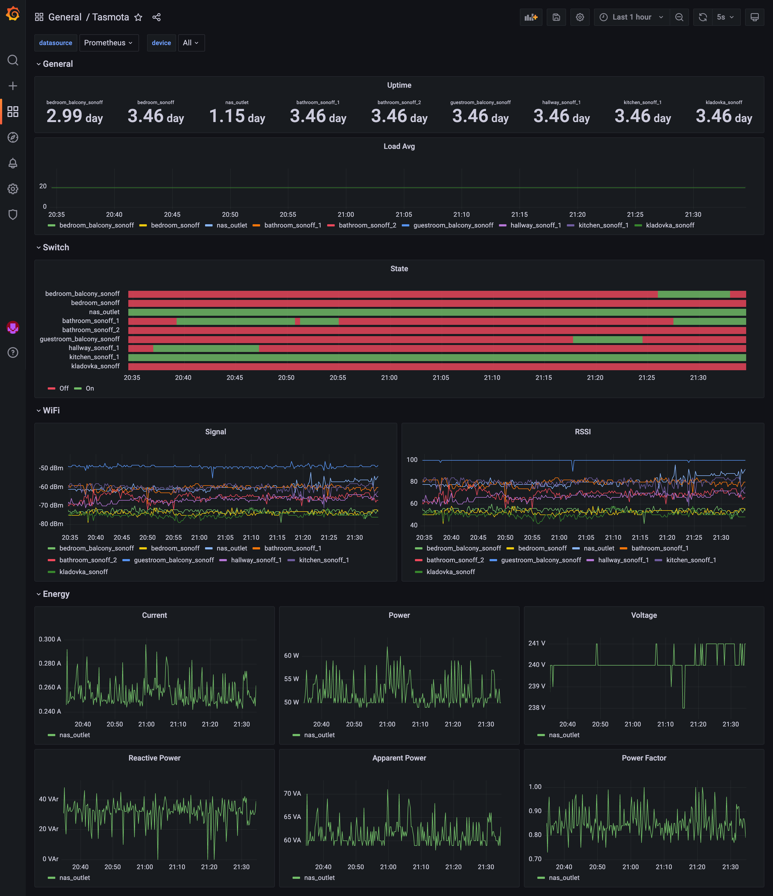

# Tasmota Prometheus Exporter

[](https://drone.rdome.net/dyrkin/tasmota-exporter)
[](https://hub.docker.com/r/eugenezadyra/tasmota-exporter/tags/)

A Prometheus exporter for [Tasmota-enabled](https://tasmota.github.io/docs) devices.  
It subscribes to the topics `tele/+/+` and `stat/++` to which Tasmota devices send their updates.



Grafana dashboard is [available here](grafana/dashboard.json) on the GitHub repository.

## Prerequisites

* [Go](https://go.dev/doc/)

## Installation

### Build from the source code

You can pull the latest version of the source code and build it using the command line:

```bash
go mod download
go build -o tasmota-exporter ./cmd
chmod +x tasmota-exporter
```

Before running the application, you have to define the following environment variables:
```yaml
MQTT_HOSTNAME: #optional. default is localhost
MQTT_PORT: #optional. default is 1883
MQTT_USERNAME: #optional. default is empty
MQTT_PASSWORD: #optional. default is empty
MQTT_CLIENT_ID: #optional. default is prometheus_tasmota_exporter
MQTT_TOPICS: #optional. default is "tele/+/+, stat/+/+". If you are using deeper topics, you can set as "tele/#, stat/#"
PROMETHEUS_EXPORTER_PORT: #optional. Default is 9092. This is listening port.
REMOVE_WHEN_INACTIVE_MINUTES: #optional. Default is 1. If the device is inactive for more than 1 minute, it will be removed from the list of active devices
STATUS_UPDATE_SECONDS: #optional. Default is 5. This is how often a status update will be requested
LOG_LEVEL: #optional. default is info. Severity level for log output. Possible values: debug, info, warn, error
```

You could also put the variables in a .env file and do the following:
```
source .env
export $(cut -d= -f1 .env)
```

Then run it using:
```bash
./tasmota-exporter
```


### Using Docker

The exporter is also available as a [Docker image](https://hub.docker.com/r/eugenezadyra/tasmota-exporter/tags).
You can run it using the following example and pass configuration environment variables:

```bash
docker run \
  -e 'MQTT_HOSTNAME=192.168.1.10' \
  -e 'MQTT_PORT=1883' \
  -e 'MQTT_USERNAME=user' \
  -e 'MQTT_PASSWORD=password' \
  -e 'PROMETHEUS_EXPORTER_PORT=9092' \
  -p 9092:9092 \
  --restart unless-stopped \
  --name tasmota-exporter \
  eugenezadyra/tasmota-exporter:latest
```

### Using docker-compose

You can run it using docker-compose and the [template](compose/docker-compose.yml):

```yaml
version: '3.4'
services:
  tasmota-exporter:
    image: eugenezadyra/tasmota-exporter:latest
    environment:
      MQTT_HOSTNAME: 192.168.1.10
      MQTT_PORT: 1883
      MQTT_USERNAME: user
      MQTT_PASSWORD: password
      PROMETHEUS_EXPORTER_PORT: 9092
    ports:
      - '9092:9092'
    restart: unless-stopped
```

```bash
#run in the background
docker-compose up -d
#update to the latest version and restart
docker-compose pull
docker-compose restart
```

Once the exporter is running, you also have to update your `prometheus.yml` configuration to let it scrape the exporter:

```yaml
scrape_configs:
  - job_name:       'tasmota'
    scrape_interval: 5s
    static_configs:
      - targets: ['metrics.home:9092']
```

**!** ***Note:*** _Available metrics may vary by device_.
